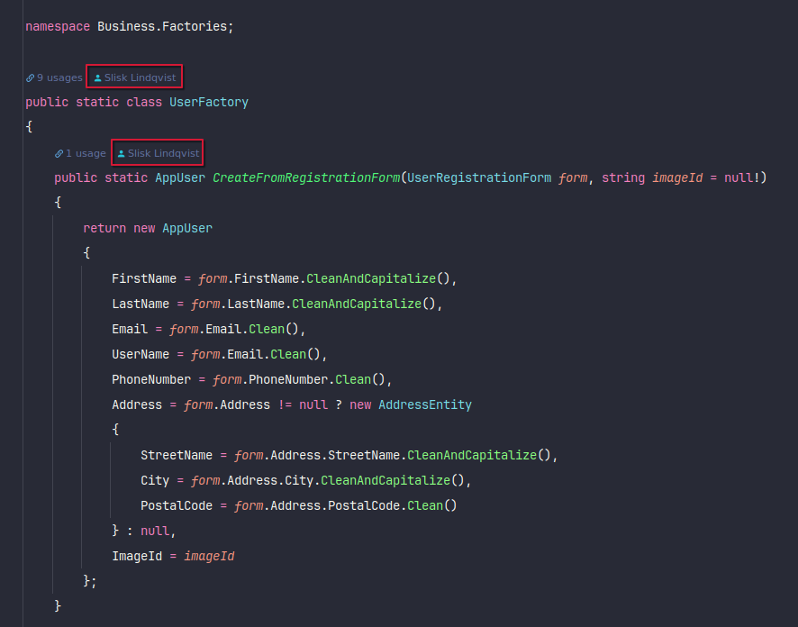
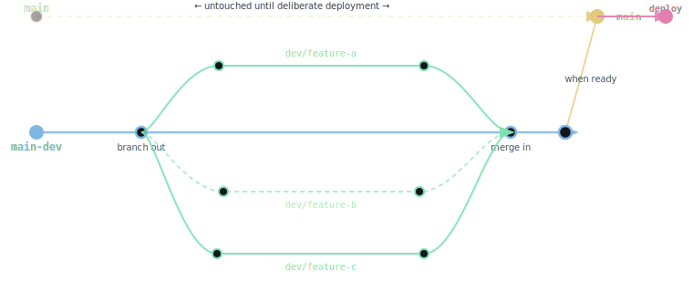

# 📦 Git Security Bootstrapper (GPG + SSH)

A system-agnostic setup script that configures **Git identity, GPG commit signing, and SSH authentication** in a clean, safe, and repeatable way across major Linux distributions.

It is designed to eliminate repetitive authentication prompts while maintaining strong cryptographic security for commits and repository access.

---

---

## 💬 Good Prompts & Examples

When interacting with Git, GitHub/GitLab, or this bootstrap setup, clarity in intent matters as much as correctness in commands.

Well-structured prompts (or requests) lead to better automation, fewer mistakes, and cleaner commits.

---

### ✅ Good Prompts

These are clear, specific, and actionable:

- ✔ “Set up SSH and GPG for Git on this machine”
- ✔ “Create a commit signing setup with GPG and explain verification”
- ✔ “Initialize a Git repository with SSH authentication only”
- ✔ “Refactor this script into atomic commits using conventional commit format”
- ✔ “Fix SSH authentication so push works without password prompts”
- ✔ “Generate a secure Git workflow for Fedora with SSH + GPG”

---

### ❌ Bad Prompts

These are vague, ambiguous, or incomplete:

- ✘ “Fix Git”
- ✘ “Make it work”
- ✘ “Setup stuff”
- ✘ “Why doesn’t this work?”
- ✘ “Improve security”
- ✘ “Do Git setup”

---

## 🧠 Prompting Principle

A good prompt should include:

- 🎯 **Goal** (what you want)
- 🧱 **Scope** (what system or part)
- ⚙️ **Constraints** (SSH, GPG, OS, etc.)
- 📦 **Expected outcome**

---

## 🔧 Example: Weak vs Strong Prompt

### ❌ Weak prompt:
> “Fix my Git setup”

### ✅ Strong prompt:
> “Configure Git so that SSH is used for authentication and GPG is used for commit signing, without repeated passphrase prompts on Fedora Linux.”

---

## 🧪 Example Prompts for This Project

### Setup-focused
- “Install and configure Git with SSH and GPG on a clean Arch Linux system”
- “Create a safe, idempotent Git bootstrap script for multiple Linux distributions”

### Debugging-focused
- “Why is Git asking for a password on push even though SSH is configured?”
- “Fix repeated GPG passphrase prompts during commit signing”

### Workflow-focused
- “Design a secure Git workflow using SSH authentication and GPG verification”
- “Define a proper commit strategy using conventional commits and atomic changes”

---

## 🧭 Mental Model

Think of Git configuration like an orchestration problem:

- SSH → *access layer*
- GPG → *trust layer*
- Git → *workflow layer*

Good prompts explicitly target the correct layer instead of mixing them.

---

## ⚙️ Features

- ✔ Automatically detects Linux distribution
- ✔ Installs required dependencies (Git, GPG, SSH tools)
- ✔ Configures Git identity (name + email with proper capitalization)
- ✔ Sets up **GPG commit signing**
- ✔ Reuses existing GPG keys (non-destructive by default)
- ✔ Sets up **SSH key authentication for push/pull**
- ✔ Starts and configures `ssh-agent`
- ✔ Configures `gpg-agent` caching to reduce passphrase prompts
- ✔ Safe re-runs (idempotent behavior)
- ✔ Optional `--force` mode for full reset

---

## 🧠 Security Model

| Layer | Purpose |
|------|--------|
| Git  | Version control |
| GPG  | Commit authenticity (identity/signature) |
| SSH  | Repository authentication (push/pull access) |

---

## 🧠 SSH vs GPG (core distinction)

SSH and GPG are often confused, but they operate at completely different layers of Git security.

---

### 🔐 SSH = authentication (access control)

SSH is used for:

- `git clone`
- `git push`
- `git pull`

It answers the question:

> “Are you allowed to access this repository?”

GitHub / GitLab verify this using your SSH key.

✔ SSH controls **repository access**

---

### ✍️ GPG = commit signing (identity verification)

GPG is used for:

- `git commit -S`

It answers the question:

> “Was this commit really created by this person?”

GitHub / GitLab display:

- ✔ “Verified” commit badge (when GPG is correctly configured)

✔ GPG controls **authorship integrity**, not access

---

---

## 🧩 What you actually need (real-world setup)

### Minimum required to use GitHub / GitLab

✔ SSH **OR** HTTPS credentials

This is enough to:

- push
- pull
- clone

GPG is NOT required for basic Git usage.

---

### Recommended secure setup (what this project configures)

✔ SSH → repository access  
✔ GPG → commit signing (trust layer)

This is the standard modern developer security model.

---

## 🔥 So in practice

> “I’m using SSH already — do I need GPG too?”

### ✔ Yes, if you care about integrity

SSH handles *access*, but not *authorship verification*.

### ✔ No, if you only want simplicity

You can use SSH alone without any issues.

---

## 🧠 What GitHub actually sees

| Feature | SSH | GPG |
|--------|-----|-----|
| Push/pull access | ✔ | ❌ |
| Authentication | ✔ | ❌ |
| “Verified” commit badge | ❌ | ✔ |
| Identity proof | partial | cryptographically strong |
| Required for Git usage | ✔ | ❌ |

---

## ⚠️ Common misconception

Many developers assume:

> “SSH replaces GPG”

This is incorrect.

They operate at different layers:

```
Git push/pull
   ↓
SSH → "Who are you?"

Git commit
   ↓
GPG → "Did you really author this?"
```

---

## 🧭 When to use what

### Use BOTH if:
- you care about security
- you contribute to open source
- you want verified commits
- you work in teams
- you want tamper-proof history

### SSH only is fine if:
- you prefer simplicity
- you are working solo
- you don’t need commit verification

---

## 💡 Recommendation

For this bootstrapper:

✔ SSH is required (workflow access)  
✔ GPG is recommended (trust & verification)

Together they form a complete developer security model.

---

## 🧠 One-line summary

- SSH = access to repositories  
- GPG = trust in commits  
- You don’t choose — you layer them

---

## 🖥️ Supported Systems

- Debian / Ubuntu (`apt`)
- Fedora (`dnf`)
- Arch Linux (`pacman`)
- openSUSE (`zypper`)
- Other `/etc/os-release` compatible Linux systems

---

## 🚀 Usage

### Standard (safe mode)

```bash
chmod +x setup-git.sh
./setup-git.sh
```

### Force mode (full reset)

⚠️ This will regenerate keys and overwrite configuration.

```bash
./setup-git.sh --force
```

---

## 🔐 What gets configured

### Git
- `user.name`
- `user.email`

### GPG
- New or existing key reused
- Commit signing enabled:

```bash
git config --global commit.gpgsign true
```

- Signing key linked to Git

### SSH
- Generates Ed25519 key (if missing)
- Starts `ssh-agent`
- Adds key automatically

---

## 📂 Output artifacts

### SSH Key
```
~/.ssh/id_ed25519
~/.ssh/id_ed25519.pub
```

### GPG Key
```
gpg --list-secret-keys
```

---

## 🧪 Mock Output

Example run on a fresh Fedora system:

```
[INFO] Detected OS: fedora

[INFO] Git not found. Installing...
[OK] Git installed successfully

First Name: john
Last Name: doe
Email: john.doe@example.com

[OK] Git identity set: John Doe <john.doe@example.com>

[INFO] Checking existing GPG keys...
[WARN] No existing GPG key found. Generating new key...

gpg: key generation started
gpg: key ABCD1234EF567890 marked as ultimately trusted

[OK] New GPG key created: ABCD1234EF567890
[OK] GPG configured

[INFO] Checking SSH key...
[WARN] Generating SSH key...

Generating public/private ed25519 key pair.
Your identification has been saved in /home/user/.ssh/id_ed25519

[OK] SSH key created
[OK] SSH key loaded into agent

==============================
SSH PUBLIC KEY (ADD TO GIT PROVIDER)
==============================
ssh-ed25519 AAAAC3NzaC1lZDI1NTE5AAAAIHk... john.doe@example.com
==============================

==============================
GPG PUBLIC KEY (ADD TO GIT PROVIDER)
==============================
-----BEGIN PGP PUBLIC KEY BLOCK-----
...
-----END PGP PUBLIC KEY BLOCK-----
==============================

[OK] SETUP COMPLETE
------------------------------------
OS        : fedora
Git User  : John Doe
Email     : john.doe@example.com
GPG Key   : ABCD1234EF567890
SSH Key   : /home/user/.ssh/id_ed25519
Mode      : SAFE
------------------------------------

Workflow:
  git add .
  git commit -S -m "Initial Commit: Project setup"
  git push origin main
```

---

## 🔁 Safe Re-run Behavior

- Existing Git identity is preserved (unless overridden)
- Existing SSH key is reused
- Existing GPG key is reused
- Only missing components are configured

---

## ⚠️ Force Mode Behavior

Using `--force`:

- Generates a new GPG key
- Generates a new SSH key
- Overwrites Git global identity
- Rebinds signing configuration

---

## 🧩 Design Philosophy

- **Idempotency** → safe to run multiple times
- **Minimal disruption** → never overwrites silently
- **Explicit control** → user decides overrides
- **Cross-distro compatibility**
- **Separation of concerns (SSH ≠ GPG ≠ Git)**

---

## 🧠 Common Pitfalls Avoided

- ❌ Repeated GPG passphrase prompts
- ❌ Git push password confusion
- ❌ Duplicate key generation
- ❌ OS-specific assumptions

---

## 📌 Recommendation

After setup, ensure your Git remote uses SSH:

```bash
git remote set-url origin git@github.com:USER/REPO.git
```

---

# Personal Git Hygiene
## Branching Strategy

All feature work happens on `main-dev`. The `main` branch is reserved for deliberate releases and triggers auto-deploy — it is never committed to directly.



| Branch | Purpose |
|---|---|
| `main` | Production — triggers auto-deploy on merge |
| `main-dev` | Integration branch — all work branches from and merges here |
| `dev/feature-*` | Feature or fix branches — created from and merged back into `main-dev` |

**Workflow:**
1. Create your branch from `main-dev`
2. Merge back into `main-dev` when done
3. When all changes are verified together, merge `main-dev → main` to release

---

## 🔮 Future upgrades (optional)

- dotfiles-style security module
- persistent agent systemd services
- multi-profile (work/personal) switching
- CI/CD hardened version

## License

MIT — do whatever you want with it.
